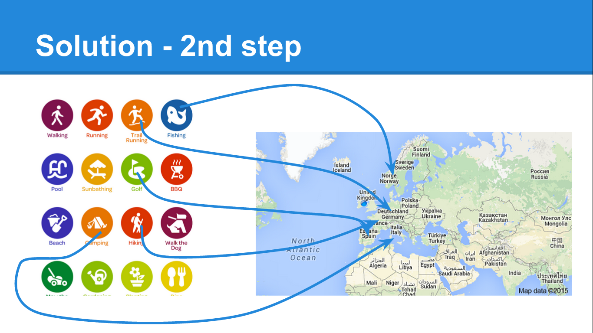

# TravelClassify

An NLP engine developed for [THack Dublin](http://www.tnooz.com/event/thack-dublin-2015/) as part of a [travel
recommendation/inspiration application](https://github.com/KlavierCat/THack) (not yet released). It suggests a user's
top 5 travel activities by classifying her social media posts based on 50+ travel activities.

## Workflow

We've manually compiled a list of 50+ known and lesser known travel activities. We created keywords and hashtags
which are indicative of these activities and extracted 15k+ tweets for each activity. We trained a Naive Bayes
classifier on these tweets using [Mallet](http://mallet.cs.umass.edu/) (MAchine Learning for LanguagE Toolkit).
In our application, we require the user to log in using his social media accounts. We are then able to extract
his social media posts, classify them, and suggest the top 5 activities that best fit the user's profile based
on the aggregated scores.

## Next steps

We are then able to suggest places to the user that suit a user's favourite activities by using the following API
features:
- [TripAdvisor Content API](https://developer-tripadvisor.com/content-api/)
- Keyword-based filtering of [Hotelbeds API](http://www.programmableweb.com/api/hotelbeds)

Similarly, we could leverage the Semantic Web or compile our own activities / cities database from unstructured data.

Expanding the activities can involve manual curation, crowd-sourcing, as well as automation (semantic similarity,
word vectors).

## Evaluation

Due to time constraints and API restrictions, we were only able to extract 350k tweets for 30 activities.
The classifier trained on these tweets has an accuracy of 85% that could be considerably improved
given more training data.

You can find the confusion matrix for the extracted 30 activities [here](confusion_matrix_30.txt).
For some activities, e.g. Canyoning, Jet skiing, Orienteering, etc. we extracted too few tweets due to API constraints.
